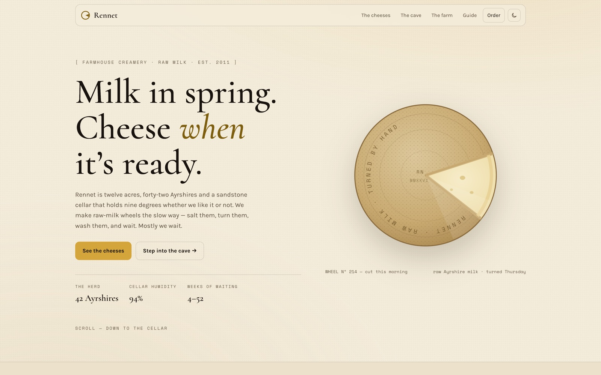

<!-- parable:beautified -->
<div align="center">

<h1>Rennet</h1>

<p><strong>Farmhouse creamery — drag a time slider and watch a wheel's rind mature across a humidity-by-weeks cave chart.</strong></p>

<p>
  <a href="https://bswxyz.github.io/rennet/"></a>
  
  
  <a href="LICENSE"></a>
</p>

<p>
  <a href="https://bswxyz.github.io/rennet/"><b>Live demo</b></a>
  &nbsp;·&nbsp;
  <a href="https://bswxyz.github.io/rennet/guide/">Build notes</a>
  &nbsp;·&nbsp;
  <a href="https://parable-three.vercel.app/templates">More templates</a>
</p>

<a href="https://bswxyz.github.io/rennet/">
  
</a>

</div>

**Use this template** — copy the source into a new project:

```bash
npx degit bswxyz/rennet my-app
```


A farmhouse-creamery website template — raw-milk aged cheeses, a herd of forty-two
Ayrshires, and a sandstone cellar that holds nine degrees all year. Built for
**Parable**, a curated showcase of individually-crafted website templates.


## The concept

Every creamery says "patience"; Rennet lets you operate it. The signature moment is an
**aging-cave data viz**: an SVG wheel of cheese matures as you drag a week slider —
the rind thickens and darkens, a humidity × temperature chart tracks the cellar's
schedule, and the tasting notes turn over. Three rind models (bloomy / washed /
natural) change the whole instrument: the aging window, the curves, the colours,
the ledger.

## Design system

- **Themes** — light is the dairy at morning (`#f4ecdb` cream on `#17120d` cellar-dark
  ink); dark is the aging cellar (flipped). Tokens live at the top of
  `src/styles/global.css` on `:root[data-theme]`; the toggle persists to
  `localStorage("rennet-theme")` and is bootstrapped inline before first paint.
- **Accents** — straw `#d4a53a` and washed-rind `#a8683a`, with per-theme darkened
  text variants (`--accent-text`, `--rind-text`) because raw straw is only ~1.9:1
  against cream.
- **Type** — Cormorant (display) / Karla (body) / Space Mono (the ledger: weeks,
  millimetres, humidity).
- **Ease** — `--ease: cubic-bezier(.32,.08,.12,1)`, "the wait": reluctant to start,
  settles without a bounce.
- **Art** — all inline SVG (hero wheel, cheese cards, the cave). No image files.

## Stack

[Astro 5](https://astro.build), static output, zero client framework. Content is
data arrays in page frontmatter; the interactions are one inline vanilla script.
No chart library — the cellar chart is two SVG path strings sampled from the rind
models.

## Run it locally

```sh
npm install
npm run dev        # http://localhost:4321/rennet/
npm run build      # emits ./docs (GitHub Pages serves main + /docs)
npm run preview
```

## Structure

```
astro.config.mjs        site/base/outDir for GitHub Pages
src/
  pages/index.astro     the page — data in frontmatter, cave script inline
  pages/guide.astro     "How Rennet was built" → /guide/
  styles/global.css     both themes' tokens at the top, then everything
  components/
    WheelArt.astro      hero wheel, wedge cut, curved rind stamp
    CheeseArt.astro     six card illustrations, one component
public/.nojekyll        keeps Pages from mangling output
```

## Demo vs. real

This is a design showcase. The creamery, herd, cellar, prices, stockists and every
tasting note are fiction. The **order form is a demo** — it validates and confirms
in place but sends nothing; wire it to a real endpoint before use. The aging models
are plausible caricatures of affinage, not food science. Raw-milk sales are
regulated — if you adapt this for a real dairy, check your rules.

## Accessibility & motion

Skip link, `:focus-visible` outlines, mono uppercase labels with real contrast,
`aria-valuetext` on the slider, a rewritten SVG `<title>` on every change, and a
dashed temperature line so the chart survives colour-blindness. Under
`prefers-reduced-motion` every reveal settles instantly, the idle cave-light sheen
stops, and the viz still works — dragging paints synchronously, no tweens.

## License

MIT — see [LICENSE](./LICENSE). Designed & built by Parable.
